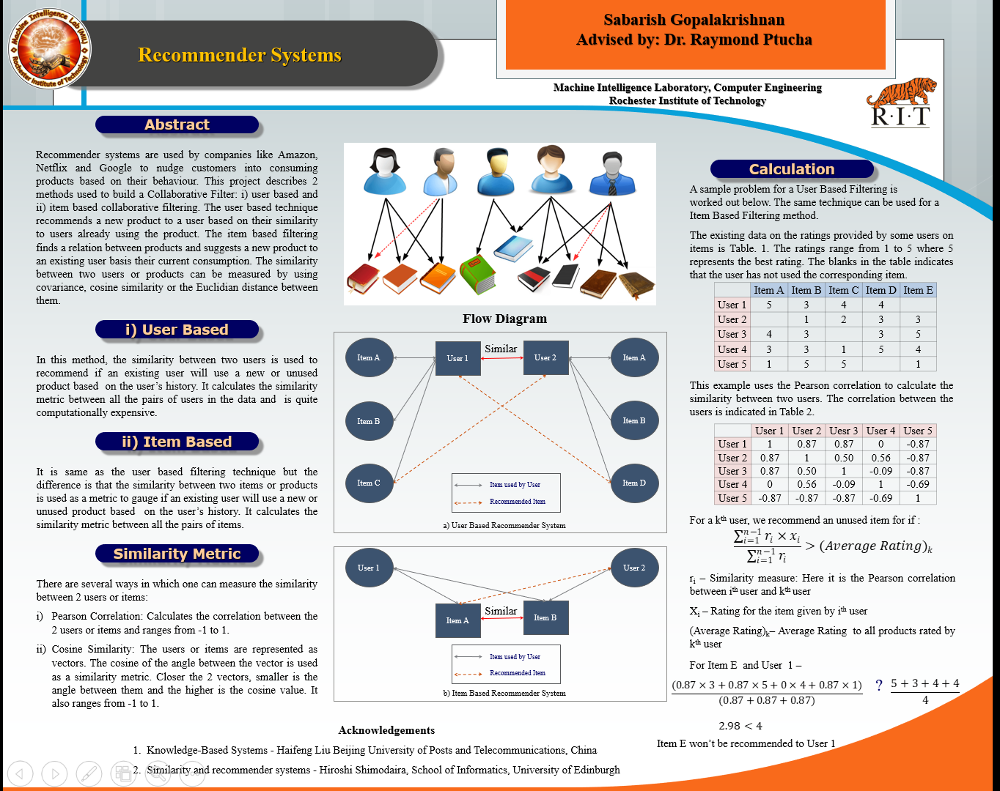

# collaborative-filter-based-recommender-systems
An R implementation of the collaborative filter based recommender systems

This code uses the a subset of the MovieLens dataset for building the recommender system.
The dataset is available at https://grouplens.org/datasets/movielens/

